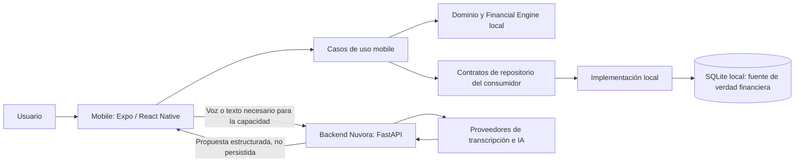
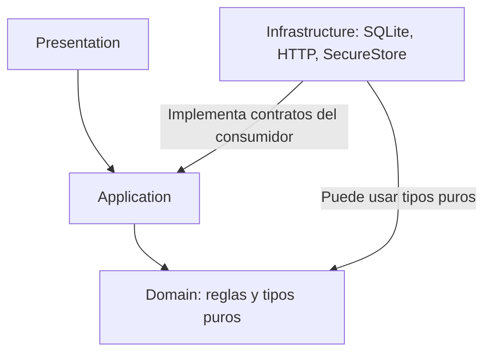
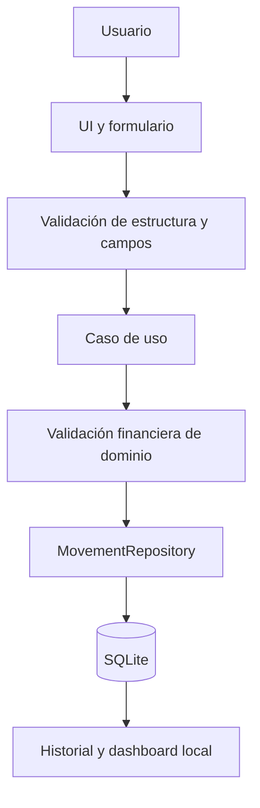
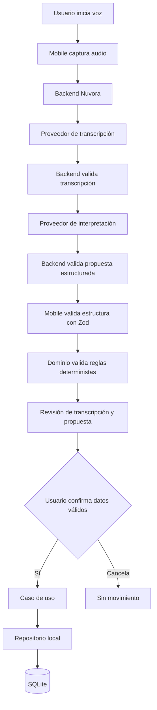

# Nuvora — Arquitectura técnica del MVP

## 1. Propósito y alcance

Este documento define los límites y las dependencias técnicas que guiarán la implementación del MVP. Se basa en `VISION.md`, `PRD.md`, `SRS.md`, `ROADMAP.md`, `USER_FLOWS.md` y `DESIGN_SYSTEM.md`. Describe responsabilidades y flujos; los esquemas de datos, endpoints, entornos, política de seguridad y estrategia detallada de pruebas corresponden a documentos posteriores.

El MVP se lanza inicialmente en Android, en español para Colombia y con COP como única moneda. La aplicación permite comenzar sin cuenta. El núcleo manual y financiero funciona sin conexión; voz e IA se incorporan después de que ese núcleo sea confiable, según los hitos 5 a 7 del roadmap. No es necesario desplegar el backend para el *walking skeleton* ni para demostrar el primer flujo financiero local.

**Decisión central: local-first + backend especializado.** SQLite en el dispositivo es la única fuente de verdad de los movimientos financieros del MVP. El backend no recibe una réplica automática del historial ni actúa como sistema financiero central. La IA interpreta y explica; el motor financiero calcula y ejecuta reglas deterministas. Toda propuesta automática vuelve al mobile para validación, revisión y confirmación antes de cualquier escritura local.



La flecha hacia el backend representa una solicitud puntual de una capacidad remota, no sincronización de movimientos. El historial y el dashboard se alimentan de SQLite incluso cuando hay conexión.

## 2. Mobile: módulos y dependencias

El stack base es Expo, React Native, TypeScript, Expo Router, Expo SQLite, Zod, React Hook Form, TanStack Query y Expo SecureStore. Se usarán **Expo Development Builds + Continuous Native Generation (CNG)** como estrategia de desarrollo. Expo Go no determina los límites del proyecto: futuras capacidades Android, como integraciones relacionadas con notificaciones o widgets, pueden necesitar código nativo; ninguna se implementa por esta decisión.

La organización es **por feature**, con separación interna de responsabilidades solo donde resulte útil:

| Responsabilidad | Contenido y límite |
| --- | --- |
| Presentation | Rutas de Expo Router, pantallas, componentes, formularios, estados puramente visuales e interacción. Muestra errores comprensibles y éxito solo después de guardar. No accede directamente a SQLite. |
| Application | Casos de uso de registro, consulta, edición, eliminación y revisión; coordina validación de flujo y reglas de Domain. Contiene los ports/contracts de infraestructura que requieren sus casos de uso, como `MovementRepository`, junto al feature consumidor. No contiene lógica de UI ni consultas SQL. |
| Domain | Conceptos, entidades, reglas y cálculos financieros puros. No conoce persistencia ni requiere contratos de repositorio, salvo una necesidad estrictamente de dominio. No depende de Application, Infrastructure ni frameworks. |
| Data / Infrastructure | Implementa los contratos definidos junto a sus consumidores mediante Expo SQLite, cliente remoto, almacenamiento seguro y adaptadores externos. Puede utilizar tipos de Domain; traduce fallos técnicos a errores que Application pueda manejar. No depende de Presentation. |

`movements`, `categories` y `dashboard` forman el núcleo inicial. `voice` y `ai` se incorporan en los hitos posteriores; `settings` aparece cuando haya ajustes reales. No se requieren todos los módulos desde el primer commit. El catálogo aprobado de gastos e ingresos pertenece al dominio de categorías; en el MVP no hay categorías personalizadas ni aprendizaje que lo modifique. `shared/core` solo reúne elementos efectivamente transversales —por ejemplo, primitivas visuales del Design System, convenciones de errores o composición de dependencias— y no absorbe reglas particulares de cada feature.



Presentation depende de Application, y Application depende de Domain. Infrastructure implementa los contratos ubicados junto a la capa o feature que los consume y puede usar tipos puros de Domain; no depende de Presentation. Las implementaciones se conectan en la composición de la aplicación. Domain no depende de Application ni Infrastructure y no importa React Native, Expo, SQLite, FastAPI, proveedores de IA ni librerías de UI. Un feature usa la superficie pública de otro cuando hay una dependencia real y evita importar sus detalles internos; así se evitan imports circulares. No se crearán interfaces, adaptadores ni capas vacías para simular una arquitectura más grande.

## 3. Dominio financiero y persistencia local

`Movement` representa conceptualmente identidad, tipo, monto, moneda COP, fecha efectiva, concepto opcional, clasificación aplicable y metadata mínima necesaria para operar y conservar el registro. Los tipos son `Expense`, `Income` y `OwnTransfer`. El monto debe ser mayor que cero. Los importes financieros deben conservar una representación exacta o decimal adecuada para dinero: no se usarán `Float`, `Double` ni otros tipos binarios de punto flotante para representarlos. La representación concreta en código y SQLite se decidirá en `DATABASE.md`. La fecha efectiva debe ser válida y determina el mes financiero, con independencia de la fecha de creación o edición. Un gasto requiere categoría principal del catálogo de gastos y admite subcategoría compatible opcional; un ingreso requiere categoría del catálogo separado de ingresos; una transferencia propia no usa ninguno de esos catálogos. No se introduce una gestión completa de cuentas de origen y destino.

El **Financial Engine** opera sobre movimientos válidos y conserva una única definición de las reglas utilizadas por registro manual, revisión de IA, edición, historial y dashboard. Determina cuáles movimientos son contabilizables, excluye transferencias propias de ingresos, gastos y resultado neto, calcula totales y gasto por categoría, y obtiene el resultado neto del período como ingresos contabilizables menos gastos contabilizables. Usa la fecha efectiva para agrupar y recalcula los períodos afectados por una edición o eliminación. Solo ofrece comparaciones cuando exista historial suficiente; el criterio exacto sigue pendiente en `TBD-004`. No delega cálculos, agrupaciones ni decisiones financieras definitivas a IA. Sus entradas y salidas se mantienen independientes de UI y persistencia para poder probarlo con datos controlados.

Los casos de uso de Application dependen de contratos conceptuales como `MovementRepository`, no de Expo SQLite. Si estos casos de uso requieren `MovementRepository`, su contrato pertenece conceptualmente a Application o al feature consumidor, no a Domain. Ese contrato cubre crear, obtener, listar, actualizar, eliminar y consultar por período. Las consultas requeridas por categorías y dashboard se expresan mediante contratos junto a su consumidor según su necesidad real, sin obligar a un repositorio por cada entidad desde el inicio. Infrastructure implementa el contrato localmente con Expo SQLite. Esta frontera permite incorporar más adelante coordinación de sincronización sin reescribir las reglas ni los casos de uso financieros.

SQLite conserva los movimientos confirmados y es la fuente de todas las consultas financieras del MVP. Las escrituras se efectúan localmente primero y se presentan como exitosas solo cuando han quedado persistidas. Una operación fallida conserva el último estado válido y no deja un movimiento parcial; las acciones repetidas no deben producir duplicados sin nueva intención. Al implementar la base se usarán migraciones versionadas e integridad local, cuyos detalles se definirán en `DATABASE.md`. Cerrar o reiniciar la aplicación no elimina movimientos válidamente guardados. No se definen aquí tablas, columnas, índices ni una estrategia concreta de acceso SQLite.

El estado persistente financiero vive en SQLite; el estado de interacción vive en el componente o feature correspondiente. React Hook Form gestiona formularios y Zod valida estructuras en mobile. TanStack Query se reserva para solicitudes y estado asíncrono del backend cuando existan; no es el almacén financiero ni convierte SQLite en una caché de un backend inexistente. SecureStore se usa solo para información apropiada que requiera almacenamiento seguro, nunca como repositorio de movimientos.

## 4. Flujos de operación

### Registro manual y operación offline



El usuario confirma la versión visible y válida; cancelar no escribe. El caso de uso vuelve a comprobar las reglas del dominio antes de persistir, incluso si el formulario ya validó entradas. Crear gastos, ingresos y transferencias propias, consultar el historial, editar, eliminar y cambiar entre meses con datos locales no dependen de la red. El dashboard calcula ingresos, gastos, neto y distribución a partir de movimientos locales; un período vacío muestra un estado válido y no inventa tendencias. La consulta del mes actual y de meses anteriores usa la fecha efectiva. La UI nunca escribe directamente en SQLite.

### Voz e interpretación mediante IA



La captura comienza por acción explícita, informa que el micrófono está activo y permite detener o cancelar. Las condiciones definitivas de permiso, información, consentimiento y tratamiento externo se resolverán en `TBD-014` antes de entregar la capacidad. La transcripción no vacía se presenta junto a la propuesta para que el usuario pueda revisar lo dicho. Una interacción de voz produce como máximo una propuesta de movimiento; una instrucción con varios movimientos requiere corrección o registros individuales, sin dividirla ni guardarla automáticamente.

La respuesta remota puede proponer tipo, monto, COP, fecha efectiva inferible, concepto o comercio y clasificación cuando haya información suficiente. Debe distinguir datos propuestos, ausentes e inciertos, sin inventar los obligatorios. La propuesta no altera historial ni dashboard. Mobile valida su estructura con Zod y luego aplica las mismas reglas de dominio del registro manual. La pantalla permite corregir, aceptar una propuesta válida o cancelar; la incertidumbre significativa requiere revisión explícita según los criterios pendientes de `TBD-003`. Solo la versión visible, válida y confirmada por el usuario pasa al caso de uso y se guarda una vez en SQLite. El éxito se comunica después de persistir.

Un error de red, timeout, proveedor no disponible, transcripción vacía, respuesta inválida, propuesta incompleta o cancelación no crea ni modifica movimientos. Se informa el estado real, se permite reintentar o salir de forma segura y permanece disponible el registro manual. Si la propuesta es incompleta pero útil, el usuario puede completarla manualmente; ningún campo inválido se guarda. El flujo remoto tampoco bloquea la consulta financiera local.

## 5. Backend y contratos remotos

El backend usa Python, FastAPI y Pydantic como **monolito modular pequeño**. API/routes reciben solicitudes; application/services coordinan transcripción e interpretación; provider adapters encapsulan integraciones; schemas validan entrada y salida; las preocupaciones transversales cubren errores, correlación y observabilidad técnica. El backend protege secretos y puede incorporar límites de uso cuando se necesiten. No almacena movimientos como fuente principal, calcula el dashboard como autoridad, ejecuta reglas financieras centrales ni mantiene sincronización o múltiples dispositivos en el MVP. No se introducen microservicios, colas, event buses, CQRS, service mesh ni Kubernetes.

Los contratos mobile ↔ backend serán versionados, con solicitudes y respuestas estructuradas, validación en ambos extremos y errores de forma consistente. El cliente define timeouts y trata las respuestas de IA como datos no confiables. Una operación remota repetible deberá contar con un mecanismo de idempotencia apropiado al definir su contrato, sin otorgar al backend permiso para persistir movimientos. Los endpoints y formatos definitivos corresponden a `API.md`.

Cada capacidad remota declara los datos mínimos que necesita. Interpretar «Gasté 42 mil en gasolina ayer» no requiere subir el historial financiero completo. El mobile no envía automáticamente todos los movimientos al backend ni adjunta datos locales no relacionados. Audio, transcripciones y contexto se limitan a la solicitud aplicable; su conservación y eliminación quedan pendientes de la política correspondiente.

## 6. Errores, seguridad, observabilidad y pruebas

Los errores de dominio expresan reglas incumplidas; los de validación identifican entradas o estructuras corregibles; los de persistencia informan que una operación local no se completó; los de red y proveedor indican indisponibilidad o fallo remoto; los inesperados se registran técnicamente y producen una salida comprensible. Infrastructure transforma excepciones específicas de SQLite, transporte o proveedores antes de que lleguen a Application. Application conserva el resultado y el estado financiero coherentes; Presentation muestra recuperación, reintento o alternativa manual. La UI no conoce excepciones técnicas concretas ni anuncia éxito anticipado.

Las claves de proveedores permanecen únicamente en backend. En entornos reales las comunicaciones remotas usan HTTPS; las entradas locales y remotas se validan y cada componente recibe el mínimo acceso necesario. SecureStore se reserva para datos apropiados y los secretos sensibles no se guardan en AsyncStorage. Los logs no incluyen secretos ni contenido financiero sensible sin necesidad. Estas decisiones estructurales no sustituyen `SECURITY.md` ni fijan políticas de retención pendientes.

Mobile debe poder observar crashes, errores técnicos y las métricas de producto requeridas por PRD/SRS, distinguiendo el inicio, finalización, abandono y corrección cuando corresponda, sin registrar por defecto contenido financiero. Backend debe permitir correlación de solicitudes, medición de latencia, errores, llamadas a proveedores y tasa de fallos. No se elige todavía un proveedor de observabilidad.

La separación permite pruebas unitarias rápidas del dominio y del Financial Engine; pruebas de casos de uso con repositorios sustitutos; pruebas de integración de los repositorios SQLite; pruebas de contratos y adaptadores del backend; y pruebas de componentes o integración mobile cuando el flujo lo requiera. La aceptación debe cubrir persistencia atómica, reapertura y reinicio, operación offline, exclusión de transferencias, períodos por fecha efectiva, revisión de propuestas y fallos remotos. `TESTING.md` definirá la estrategia detallada.

## 7. Evolución y estructura conceptual

Una futura sincronización podría conectar los casos de uso de Application con su contrato de repositorio, la implementación local, un coordinador de sincronización y un repositorio remoto. El dominio financiero seguiría independiente de esos mecanismos. Esa evolución requeriría decisiones sobre identidad, IDs estables, timestamps, versiones, tombstones, conflictos, backup y continuidad offline. Ninguna de esas reglas se diseña ni implementa en el MVP; el límite de repositorio y el aislamiento del dominio evitan cerrarle el paso. Inicialmente los datos están ligados al dispositivo: no hay backup cloud ni uso multidispositivo, y la pérdida o reinstalación puede afectar los datos antes de que exista una solución de respaldo.

La siguiente estructura es orientativa y se validará al iniciar el código; no prescribe directorios profundos ni obliga a crear módulos sin uso:

```text
apps/
  mobile/
    app/                 rutas de Expo Router
    src/
      features/          movements, categories, dashboard; luego voice, ai, settings
      domain/            reglas transversales del núcleo financiero, si las hay
      infrastructure/    composición y adaptadores locales/remotos
      shared/            únicamente primitivas y convenciones compartidas
  api/                   backend modular cuando sea necesario
docs/
  product/
  ux/
  technical/
```

## 8. Decisiones arquitectónicas registradas

Estas ADR son conceptuales; no se crean archivos separados.

| ADR | Decisión y contexto | Consecuencia positiva | Trade-off aceptado |
| --- | --- | --- | --- |
| ADR-001 — Local-first | SQLite en el dispositivo es la fuente de verdad financiera del MVP; las operaciones esenciales deben funcionar offline. | Respuesta local, menor dependencia de red y control de datos. | Datos ligados inicialmente al dispositivo y sin backup cloud. |
| ADR-002 — Backend especializado | El backend atiende voz, IA, secretos e integraciones; no es backend financiero central. | Reduce alcance y exposición de datos del MVP. | Las capacidades remotas dependen de red y proveedor. |
| ADR-003 — IA fuera del dominio financiero | IA interpreta, clasifica, propone y explica; el dominio valida, calcula y ejecuta. | Resultados deterministas y propuestas corregibles. | La revisión humana añade un paso antes del guardado asistido. |
| ADR-004 — SQLite detrás de repositorios | Casos de uso dependen de contratos y SQLite los implementa. | Pruebas aisladas y posibilidad de evolución futura. | Se mantiene una frontera de abstracción que debe justificarse con casos de uso reales. |
| ADR-005 — Backend como monolito modular | FastAPI agrupa rutas, servicios, esquemas y adaptadores en un servicio pequeño. | Despliegue y operación iniciales simples. | Si crece, hará falta mantener límites internos claros. |
| ADR-006 — Development Builds + CNG | La base Expo se desarrolla con builds nativos y generación continua. | Permite capacidades Android nativas futuras sin rediseñar la base. | Requiere un ciclo de build más elaborado que Expo Go. |

La arquitectura favorece uso offline, privacidad, menor complejidad inicial y validación temprana del producto. Acepta explícitamente la ausencia de sincronización, backup cloud y multidispositivo en el MVP; añadirlos más adelante requerirá trabajo adicional.

## 9. Decisiones pendientes y consistencia

- **Antes de implementar la persistencia:** estrategia concreta de acceso a SQLite y diseño de migraciones, integridad y esquema en `DATABASE.md`.
- **Antes de entregar voz/IA:** proveedores de transcripción e IA; política de conservación y eliminación de audio, transcripciones, movimientos y correcciones (`TBD-005`); condiciones de conexión, permiso, información enviada, consentimiento y tratamiento externo (`TBD-014`); criterios de incertidumbre (`TBD-003`); contratos definitivos en `API.md`.
- **Antes de aceptar comparaciones:** definición de historial suficiente (`TBD-004`).
- **Antes de evaluar metas no funcionales:** objetivos de tiempos y medición (`TBD-001`, `TBD-002`, `TBD-006`), compatibilidad Android (`TBD-007`), métricas numéricas (`TBD-009`) y selección concreta de observabilidad.
- **Fuera del MVP:** identidad o cuenta futura (`TBD-011`), estrategia cloud, eventual PostgreSQL, backup, sincronización y resolución de conflictos (`TBD-010`).

La revisión contra los seis documentos aprobados no identifica contradicciones funcionales con esta arquitectura. El roadmap aún marca algunos entregables de UX como pendientes aunque los documentos ya contienen decisiones aprobadas; esto es un estado editorial que no cambia su contenido ni el orden de implementación. La referencia WCAG 2.2 AA del Design System ya está aprobada y no se reabre como decisión técnica pendiente; su cumplimiento se comprobará durante la implementación.
