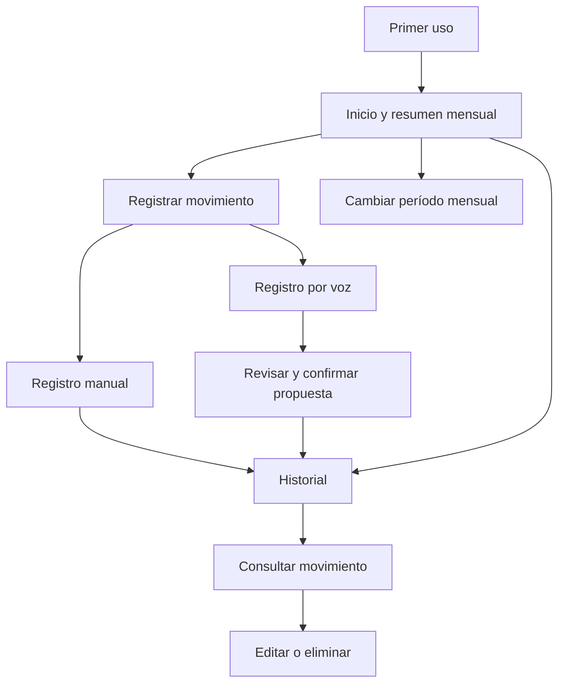
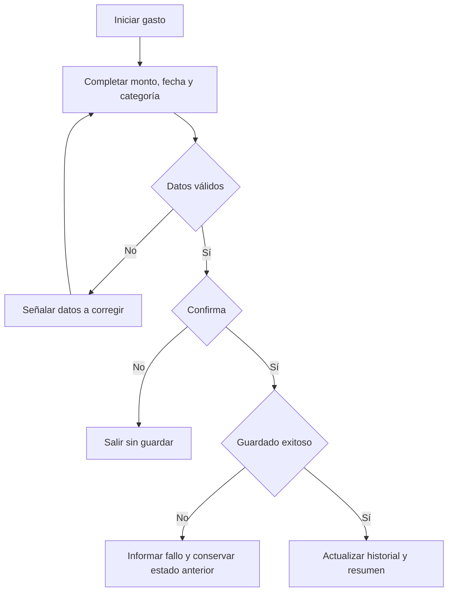
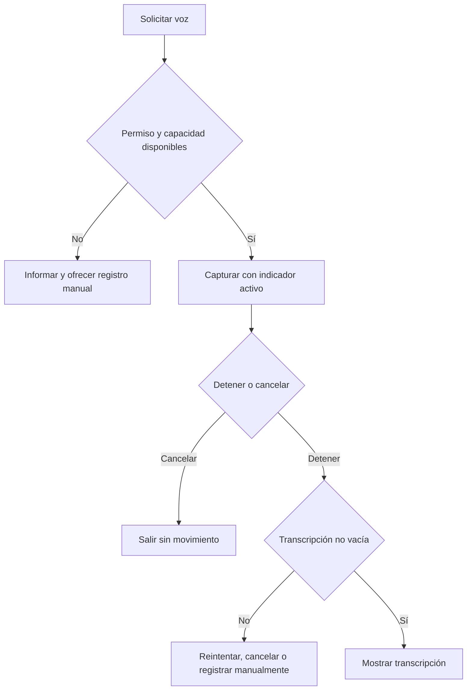
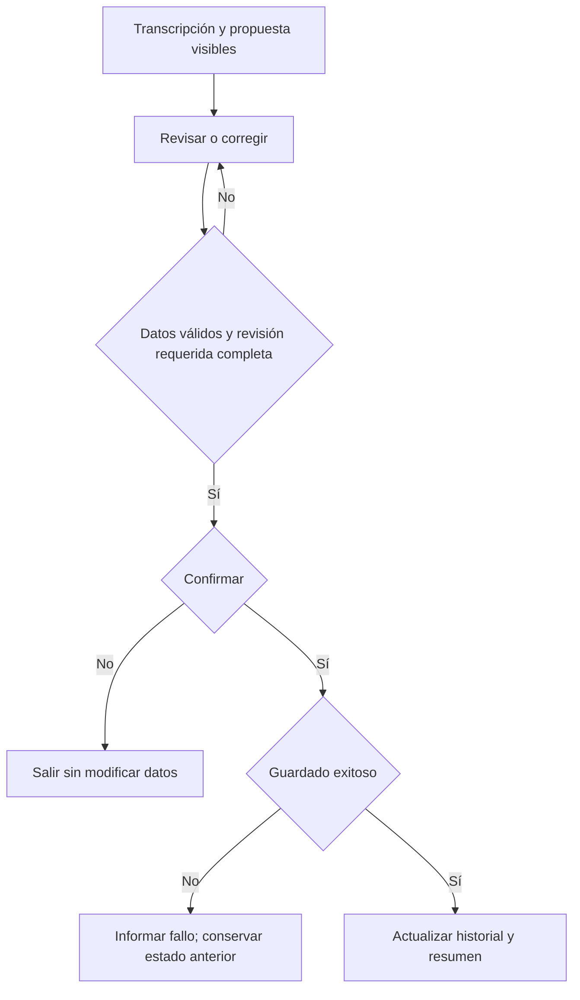

# Nuvora — User Flows

## 1. Propósito

Este documento describe los recorridos principales del MVP de Nuvora desde la intención de la persona hasta el resultado observable. Traduce los comportamientos del [SRS](../product/SRS.md) en interacciones comprensibles, con apoyo de la [visión](../product/VISION.md), el [PRD](../product/PRD.md) y el [roadmap](../product/ROADMAP.md). No prescribe pantallas, navegación visual ni implementación.

El alcance es el MVP para Android en Colombia, en español y exclusivamente en COP. Los flujos posteriores al MVP no se incluyen. Las decisiones todavía abiertas se conservan como TBD en la sección 8.

## 2. Convenciones

- **UF-###** identifica un flujo; **RF**, **RN** y **RNF** remiten al SRS. Una flecha expresa secuencia o decisión, no una transición entre pantallas.
- **Movimiento** significa gasto, ingreso o transferencia propia. **Fecha efectiva** es la fecha en que ocurrió y determina su mes financiero.
- **Propuesta** es información sugerida por voz o IA, todavía no guardada. **Confirmar** es la acción del usuario; **guardar** es la conservación exitosa posterior a la validación. Solo después de guardar se actualizan historial y resúmenes.
- Las alternativas y errores describen resultados esperados, no textos definitivos de interfaz. Los diagramas `flowchart TD` muestran únicamente decisiones que conviene visualizar.
- Los requisitos relacionados al final de cada flujo señalan sus vínculos principales. La tabla de la sección 7 consolida la trazabilidad funcional.

## 3. Principios UX aplicables a los flujos

- Dar una ruta inequívoca y breve a las acciones frecuentes; mostrar valor antes de pedir esfuerzo adicional.
- Permitir empezar sin cuenta y mantener el registro manual disponible, incluso si fallan voz, IA o la conexión.
- Conservar el control del usuario: revisar, corregir, confirmar o cancelar. Una sugerencia automática nunca modifica datos por sí sola.
- Comunicar el estado de las operaciones y sus fallos sin dejar dudas sobre si un movimiento quedó guardado. Una acción fallida conserva el último estado válido y no produce duplicados.
- Mantener apertura, historial, registro manual de gastos, ingresos y transferencias propias, gestión de movimientos y resúmenes calculables sin Internet.
- Expresar incertidumbre y ausencias sin inventar datos. La IA interpreta; las reglas financieras determinan validez, totales y agrupaciones.
- Identificar el **resultado neto del período** como ingresos contabilizables menos gastos contabilizables. No presentarlo como saldo bancario disponible.
- Utilizar lenguaje cotidiano colombiano y comunicar estados, errores y resultados de manera comprensible, también para tecnologías de accesibilidad compatibles, sin depender solo del color. Los umbrales visuales y táctiles siguen pendientes en TBD-008.

## 4. Mapa general del MVP

El mapa representa funciones y puntos de entrada conceptuales. No establece tabs, rutas ni otros componentes de navegación.

## 5. Flujos principales

### UF-001 — Primer uso

- **Objetivo:** comprender para qué sirve Nuvora y llegar rápidamente al primer movimiento.
- **Punto de entrada:** primera apertura de la aplicación.
- **Precondiciones:** aplicación disponible; no se requiere cuenta ni movimientos previos.
- **Flujo principal:** 1. Nuvora comunica brevemente que permite registrar y comprender movimientos con poco esfuerzo. 2. Presenta la experiencia en español colombiano y los importes en COP, sin solicitar selección de mercado, idioma o moneda. 3. La persona elige comenzar un registro. 4. Nuvora abre el inicio del flujo manual o de voz que corresponda, sin autenticación.
- **Alternativas:** la persona puede continuar hacia el producto sin registrar todavía; encontrará el resumen y el historial en sus estados vacíos, junto con una ruta clara al primer registro.
- **Errores relevantes:** si un registro iniciado se abandona, no se crea un movimiento; el acceso al producto permanece disponible.
- **Resultado:** la persona entiende el valor principal y puede iniciar su primer registro sin cuenta.
- **Requisitos SRS relacionados:** RF-ONB-001–004, RF-GES-001, RNF-UX-001–002.

### UF-002 — Registrar gasto manual

- **Objetivo:** conservar un gasto válido con el menor esfuerzo razonable.
- **Punto de entrada:** acción de registrar movimiento desde primer uso o desde el producto.
- **Precondiciones:** registro manual disponible, con o sin conexión.
- **Flujo principal:** 1. La persona inicia el registro y elige **gasto**. 2. Introduce un monto en COP mayor que cero. 3. Nuvora propone inicialmente la fecha actual como fecha efectiva y permite modificarla. 4. La persona elige una categoría principal del catálogo de gastos; puede elegir una subcategoría perteneciente a ella y añadir un concepto, ambos opcionales. 5. Nuvora valida tipo, monto, fecha y clasificación; la persona revisa y confirma. 6. Solo si el guardado se completa, Nuvora comunica el éxito, muestra el gasto en el historial y actualiza el mes de su fecha efectiva, incluidos total de gastos, resultado neto y distribución.
- **Alternativas:** se puede omitir subcategoría o concepto; se puede cancelar antes del guardado, sin crear datos. Si se cambia el tipo, una categoría incompatible deja de ser válida.
- **Errores relevantes:** monto vacío, cero, negativo o inválido; categoría ausente o incompatible; subcategoría ajena a la categoría elegida; fecha ausente o inválida; fallo de guardado. Se señala lo corregible y no se altera el estado financiero.
- **Resultado:** un único gasto válido y conservado, o ningún cambio si se cancela o falla. Una confirmación repetida sin nueva intención no crea un duplicado.
- **Requisitos SRS relacionados:** RF-MOV-001–002, RF-MOV-005–009, RF-CAT-001, RF-CAT-003–004, RF-PER-003, RF-GES-005, RF-ANA-001; RN-001–004, RN-011–012.

### UF-003 — Registrar ingreso manual

- **Objetivo:** conservar un ingreso válido y reflejarlo en el resultado mensual.
- **Punto de entrada:** acción de registrar movimiento.
- **Precondiciones:** registro manual disponible, con o sin conexión.
- **Flujo principal:** 1. La persona elige **ingreso**. 2. Introduce un monto en COP mayor que cero. 3. Revisa la fecha efectiva inicialmente actual y puede cambiarla. 4. Elige una categoría obligatoria del catálogo de ingresos y, si quiere, añade un concepto. 5. Nuvora valida los datos; la persona confirma. 6. Tras guardarse correctamente, Nuvora comunica el resultado, incluye el ingreso en el historial y actualiza ingresos y resultado neto del mes de la fecha efectiva.
- **Alternativas:** omitir el concepto o cancelar sin guardar. No se ofrece una subcategoría de gasto para un ingreso; al cambiar de tipo se invalida una categoría incompatible.
- **Errores relevantes:** monto vacío, cero, negativo o inválido; categoría ausente o del catálogo equivocado; fecha inválida; fallo de guardado. Ninguno produce cambios parciales.
- **Resultado:** un ingreso conservado una sola vez, o ningún cambio.
- **Requisitos SRS relacionados:** RF-MOV-001, RF-MOV-003, RF-MOV-005–009, RF-CAT-002–004, RF-PER-003, RF-GES-005, RF-ANA-001; RN-001, RN-004, RN-012–013.

### UF-004 — Registrar transferencia propia

- **Objetivo:** registrar un traslado de dinero propio sin tratarlo como ingreso o gasto.
- **Punto de entrada:** acción de registrar movimiento.
- **Precondiciones:** registro manual disponible, con o sin conexión.
- **Flujo principal:** 1. La persona elige **transferencia propia**. 2. Introduce un monto válido en COP y revisa o modifica la fecha efectiva inicialmente actual. 3. Puede añadir un concepto. 4. Nuvora valida monto y fecha, sin solicitar categoría de gastos o ingresos. 5. La persona confirma. 6. Tras guardarse, la transferencia aparece en el historial; los totales de ingresos, gastos y resultado neto no cambian.
- **Alternativas:** omitir concepto o cancelar sin guardar. No se requieren cuentas de origen y destino en este MVP.
- **Errores relevantes:** monto inválido, fecha inválida o fallo de guardado; se mantiene el estado anterior.
- **Resultado:** transferencia consultable, excluida de los totales financieros.
- **Requisitos SRS relacionados:** RF-MOV-001, RF-MOV-004–009, RF-CAT-003, RF-GES-001, RF-PER-003, RF-OFF-002, RF-ANA-001; RN-001, RN-005–006, RN-012.

### UF-005 — Consultar historial

- **Objetivo:** encontrar y revisar movimientos ya guardados.
- **Punto de entrada:** función de historial desde el producto.
- **Precondiciones:** aplicación abierta; pueden existir o no movimientos.
- **Flujo principal:** 1. La persona abre el historial. 2. Nuvora presenta los movimientos disponibles e identifica en cada uno, al menos, tipo, monto en COP y clasificación o concepto disponible. 3. La persona selecciona uno. 4. Nuvora muestra los datos vigentes, incluida su fecha efectiva, sin modificarlos.
- **Alternativas:** si no hay movimientos, Nuvora muestra un estado vacío válido y permite iniciar un registro; si hay datos guardados y no hay conexión, siguen consultables.
- **Errores relevantes:** una consulta no debe presentar como guardada una operación que falló ni una propuesta de IA no confirmada.
- **Resultado:** información del movimiento disponible para lectura o un estado vacío comprensible.
- **Requisitos SRS relacionados:** RF-GES-001–002, RF-PER-001–002, RF-OFF-001, RNF-REL-001–002.

### UF-006 — Editar movimiento

- **Objetivo:** corregir un movimiento conservando coherencia entre historial y resúmenes.
- **Punto de entrada:** consulta de un movimiento del historial.
- **Precondiciones:** existe un movimiento consultable.
- **Flujo principal:** 1. La persona inicia la edición y cambia los datos editables, incluida la fecha efectiva o la clasificación aplicable. 2. Nuvora aplica otra vez las reglas de tipo, monto, fecha y categoría. 3. La persona confirma los cambios válidos. 4. Una vez guardados, Nuvora comunica el resultado y muestra los datos nuevos. 5. Recalcula los totales y agrupaciones afectados; si cambió el mes de la fecha efectiva, actualiza tanto el mes anterior como el nuevo.
- **Alternativas:** cancelar conserva íntegro el movimiento original; corregir después del guardado una categoría sugerida usa este mismo flujo. Si cambia el tipo, se requiere una clasificación compatible con el nuevo tipo.
- **Errores relevantes:** datos inválidos o fallo de guardado impiden sustituir el movimiento; los resúmenes permanecen en el último estado válido.
- **Resultado:** edición confirmada y conservada, o movimiento original intacto.
- **Requisitos SRS relacionados:** RF-GES-002–003, RF-GES-005, RF-MOV-005–007, RF-MOV-009, RF-CAT-003–004, RF-AUT-003, RF-PER-003, RF-OFF-003; RN-002–006, RN-012–013.

### UF-007 — Eliminar movimiento

- **Objetivo:** retirar deliberadamente un movimiento incorrecto.
- **Punto de entrada:** consulta de un movimiento del historial.
- **Precondiciones:** existe un movimiento consultable.
- **Flujo principal:** 1. La persona inicia la eliminación. 2. Nuvora comunica qué movimiento sería eliminado y solicita una confirmación deliberada, sin fijar el mecanismo visual. 3. La persona confirma. 4. Solo tras completarse la eliminación, Nuvora comunica el resultado, retira el movimiento del historial y recalcula los totales y agrupaciones de su mes efectivo.
- **Alternativas:** cancelar conserva el movimiento y sus cálculos.
- **Errores relevantes:** si la eliminación falla, se informa, el movimiento continúa disponible y los resúmenes no cambian; repetir la acción sin nueva intención no genera resultados inesperados.
- **Resultado:** movimiento eliminado de forma verificable, o estado anterior conservado.
- **Requisitos SRS relacionados:** RF-GES-002, RF-GES-004–005, RF-PER-003, RF-OFF-003, RNF-SEC-004, RNF-REL-002–004.

### UF-008 — Consultar dashboard mensual

- **Objetivo:** comprender la actividad financiera registrada del mes.
- **Punto de entrada:** función de resumen mensual.
- **Precondiciones:** aplicación abierta; pueden existir o no movimientos.
- **Flujo principal:** 1. Nuvora presenta por defecto el mes actual. 2. Calcula con los movimientos válidos de ese mes, según fecha efectiva, total de ingresos, total de gastos y resultado neto = ingresos − gastos. 3. Si hay gastos, muestra su distribución por categoría principal; el total distribuido coincide con el total de gastos. 4. Identifica el resultado como correspondiente a movimientos registrados, sin llamarlo saldo bancario disponible.
- **Alternativas:** sin movimientos presenta un estado vacío y totales equivalentes a cero; sin gastos no inventa una distribución. Las transferencias pueden estar en el historial, pero no entran en esos totales.
- **Errores relevantes:** un movimiento no guardado o una propuesta sin confirmar no afecta el resumen; ante operación fallida se conserva el cálculo previo coherente.
- **Resultado:** lectura mensual verificable de los datos disponibles.
- **Requisitos SRS relacionados:** RF-DASH-001–004, RF-DASH-006–007, RF-GES-005, RF-OFF-004; RN-005–008, RN-012.

### UF-009 — Cambiar período mensual

- **Objetivo:** consultar un mes anterior y, cuando proceda, compararlo con otros períodos.
- **Punto de entrada:** resumen mensual abierto.
- **Precondiciones:** existe un mes anterior con movimientos para seleccionarlo.
- **Flujo principal:** 1. La persona selecciona un mes anterior con información. 2. Nuvora recalcula ingresos, gastos, resultado neto y distribución usando exclusivamente movimientos cuya fecha efectiva pertenece a ese mes. 3. Presenta el período seleccionado y sus resultados. 4. Solo si se cumple el criterio de historial suficiente, presenta comparaciones e identifica categorías de gasto en crecimiento.
- **Alternativas:** volver al mes actual; con historial insuficiente se omiten las comparaciones o se indica su indisponibilidad, sin inferir tendencias.
- **Errores relevantes:** una edición que cambie la fecha efectiva obliga a actualizar los meses afectados; los meses no se asignan por fecha de creación o modificación.
- **Resultado:** resumen coherente del mes elegido, con comparaciones solo cuando hay base suficiente.
- **Requisitos SRS relacionados:** RF-DASH-001–007, RF-GES-005, RN-010, RN-012.

### UF-010 — Iniciar registro mediante voz

- **Objetivo:** obtener una transcripción revisable de un movimiento expresado oralmente.
- **Punto de entrada:** solicitud explícita de registrar mediante voz.
- **Precondiciones:** capacidad disponible y condiciones aplicables de información, permiso y consentimiento satisfechas según TBD-005 y TBD-014.
- **Flujo principal:** 1. Nuvora informa qué captura y para qué se usa; si existe procesamiento externo, informa qué clase de información se enviará, para qué y cuándo. 2. La persona concede la autorización aplicable e inicia la captura. 3. Nuvora muestra que el micrófono está activo durante toda la grabación. 4. La persona detiene la captura y el indicador deja de mostrar actividad. 5. Nuvora convierte el audio en texto y presenta la transcripción para revisión; el proceso continúa hacia UF-011.
- **Alternativas:** cancelar la grabación termina el intento sin crear movimiento; permiso rechazado, capacidad indisponible o conexión requerida ausente permiten salir o pasar al registro manual. Mientras se procesa, la persona puede consultar o abandonar de forma segura el flujo disponible.
- **Errores relevantes:** fallo de conversión o transcripción vacía se comunican como fallo, nunca como éxito; se puede reintentar, cancelar o usar registro manual cuando haya contexto útil.
- **Resultado:** transcripción no vacía disponible para interpretación, o ningún movimiento creado.
- **Requisitos SRS relacionados:** RF-VOZ-001–006, RF-OFF-004, RF-ANA-002, RNF-PRIV-001–005, RNF-PERF-001–002.

### UF-011 — Interpretar movimiento mediante IA

- **Objetivo:** convertir una transcripción en una propuesta de un solo movimiento.
- **Punto de entrada:** transcripción no vacía obtenida en UF-010.
- **Precondiciones:** interpretación disponible y condiciones aplicables de conectividad e información satisfechas.
- **Flujo principal:** 1. Nuvora interpreta el texto e intenta proponer tipo, monto, COP, fecha efectiva cuando el lenguaje permita inferirla, concepto o comercio disponible, categoría y subcategoría cuando haya información suficiente. 2. Presenta la propuesta como sugerencia, diferenciando datos ciertos, ausentes e inciertos y explicando lo relevante. 3. Aplica reglas deterministas de validez antes de permitir guardarla y continúa hacia UF-012 para revisión humana.
- **Alternativas:** si faltan datos obligatorios, quedan señalados para completar, sin inventarlos. Una referencia temporal explícita interpretable se intenta reflejar en la fecha propuesta. Si no puede obtenerse una propuesta útil, la persona puede reintentar o completar un registro manual.
- **Errores relevantes:** fallo, resultado inválido o pérdida de conexión no crean movimientos; la incertidumbre significativa se comunica conforme al futuro criterio TBD-003.
- **Resultado:** propuesta revisable, todavía sin efectos en historial ni dashboard.
- **Requisitos SRS relacionados:** RF-IA-001–005, RF-VOZ-005–007, RF-CONF-001, RF-CONF-005, RF-MOV-005–006, RF-MOV-009; RN-001, RN-008–009, RN-012.

### UF-012 — Revisar y confirmar propuesta

- **Objetivo:** guardar únicamente la versión válida que la persona revisó y confirmó.
- **Punto de entrada:** propuesta estructurada resultante de UF-011.
- **Precondiciones:** transcripción y propuesta disponibles para revisión.
- **Flujo principal:** 1. Nuvora presenta juntas la transcripción y la propuesta: tipo, monto, COP, fecha efectiva, concepto disponible y clasificación, o señala datos ausentes. 2. Distingue los datos inciertos; la persona revisa y corrige cualquiera de los campos editables, incluida la categoría. 3. Nuvora valida nuevamente con las mismas reglas del registro manual. 4. La persona confirma explícitamente la versión visible. 5. Tras un guardado exitoso de un solo movimiento, Nuvora comunica el resultado y actualiza historial y resúmenes del mes efectivo.
- **Alternativas:** aceptar la propuesta sin cambios si es válida, completar datos faltantes, pasar al registro manual con el contexto útil o cancelar sin alterar datos. Una propuesta con incertidumbre significativa requiere revisión explícita antes de guardar.
- **Errores relevantes:** monto, fecha, tipo o clasificación inválidos bloquean el guardado; un fallo de persistencia conserva el estado anterior. Regenerar una propuesta no modifica datos financieros.
- **Resultado:** movimiento válido y confirmado conservado, o ningún cambio. Se distingue analíticamente una interpretación confirmada sin cambios de una corregida.
- **Requisitos SRS relacionados:** RF-CONF-001–005, RF-IA-002–005, RF-MOV-005–006, RF-MOV-009, RF-PER-003, RF-GES-005, RF-ANA-002; RN-008, RN-012, RNF-REL-005.

### UF-013 — Instrucción de voz con múltiples movimientos

- **Objetivo:** evitar que una sola interacción cree varios movimientos o uno ambiguo.
- **Punto de entrada:** transcripción que expresa más de un movimiento, por ejemplo «Compré almuerzo por 30 mil y después tanqueé 80 mil».
- **Precondiciones:** transcripción disponible; se detecta más de un movimiento expresado.
- **Flujo principal:** 1. Nuvora identifica que el contenido no corresponde a un único registro del MVP. 2. Informa que cada movimiento debe registrarse por separado. 3. La persona elige corregir la instrucción o iniciar un registro individual. 4. Solo una propuesta individual revisada y confirmada puede seguir UF-012.
- **Alternativas:** reintentar por voz con un movimiento, registrar cada movimiento manualmente o cancelar.
- **Errores relevantes:** no dividir ni guardar automáticamente dos movimientos; tampoco confirmar un registro ambiguo que mezcle sus datos.
- **Resultado:** ningún movimiento se crea por la instrucción múltiple; cada registro posterior conserva su propia intención y confirmación.
- **Requisitos SRS relacionados:** RF-VOZ-007, RF-IA-001, RF-CONF-001–004; RN-009.

### UF-014 — Categorización automática

- **Objetivo:** reducir trabajo de clasificación sin quitar control sobre la categoría.
- **Punto de entrada:** registro o revisión de un gasto o ingreso con datos interpretables.
- **Precondiciones:** tipo conocido y catálogo correspondiente disponible.
- **Flujo principal:** 1. Nuvora propone una categoría válida del catálogo aplicable e identifica que es sugerida. 2. La persona la acepta o la sustituye por otra válida; para un gasto puede revisar una subcategoría opcional compatible. 3. La categoría aceptada o corregida participa en la validación del movimiento. 4. Solo después de confirmar y guardar el movimiento se refleja en su clasificación y, para gastos, en la distribución del mes. 5. El resultado aceptado o corregido queda distinguible para medir la calidad de la sugerencia.
- **Alternativas:** si no existe información suficiente, Nuvora no inventa una categoría; la persona elige la categoría obligatoria antes de guardar. Una categoría guardada puede corregirse después mediante UF-006.
- **Errores relevantes:** categoría ausente, incompatible o subcategoría ajena bloquea el guardado aplicable; aceptar la sugerencia por sí solo no guarda el movimiento.
- **Resultado:** clasificación válida controlada por la persona. Las correcciones no crean categorías nuevas ni modifican el catálogo automáticamente.
- **Requisitos SRS relacionados:** RF-AUT-001–004, RF-ANA-003, RF-CAT-001–004, RF-MOV-006, RF-GES-003; RN-002–004, RN-011, RN-013.

### UF-015 — Uso offline

- **Objetivo:** continuar el uso financiero esencial cuando no hay Internet.
- **Punto de entrada:** apertura o uso de Nuvora sin conexión, o pérdida de conexión durante una sesión.
- **Precondiciones:** aplicación disponible en un dispositivo Android compatible; para consultar o editar, existen datos previamente disponibles.
- **Flujo principal:** 1. La persona abre Nuvora y consulta historial y movimientos disponibles. 2. Puede registrar gastos, ingresos y transferencias propias manualmente y editar o eliminar movimientos disponibles. 3. Nuvora valida, conserva y refleja las operaciones exitosas con las mismas reglas financieras que en línea. 4. Presenta el dashboard calculado con los datos disponibles y mantiene los movimientos confirmados al cerrar, reabrir o reiniciar.
- **Alternativas:** si voz o IA requieren conexión conforme a TBD-014, Nuvora informa su indisponibilidad y ofrece registro manual; no crea datos supuestos ni promete una transcripción o interpretación inexistente. Un historial vacío sigue siendo un estado válido.
- **Errores relevantes:** una operación local fallida no deja datos parciales ni resúmenes divergentes; perder conexión durante voz o IA no bloquea el registro manual.
- **Resultado:** captura manual, gestión, consulta y resúmenes siguen disponibles sin Internet; voz e IA fallan de forma segura cuando dependan de él.
- **Requisitos SRS relacionados:** RF-OFF-001–004, RF-PER-001–003, RF-GES-001–005, RF-MOV-002–004, RF-DASH-001–004, RF-VOZ-006, RNF-PERF-003, RNF-COMP-003, RNF-REL-001–005.

## 6. Flujos de error y recuperación

| Situación | Respuesta esperada | Recuperación |
| --- | --- | --- |
| Monto vacío, cero, negativo o inválido | Impedir confirmación y señalar el monto; historial y resumen siguen intactos. | Corregir el monto y volver a validar, o cancelar. |
| Categoría obligatoria ausente o incompatible | No guardar el gasto o ingreso; indicar la clasificación requerida del catálogo correcto. | Elegir categoría válida; subcategoría de gasto puede omitirse. |
| Fecha efectiva ausente o inválida | Impedir guardado y conservar los períodos previos. | Indicar una fecha válida y confirmar de nuevo. |
| Fallo al guardar, editar o eliminar | Comunicar que la operación no terminó; conservar el último movimiento y resumen válidos, sin datos parciales. | Revisar los datos disponibles y reintentar mediante una acción explícita. |
| Pérdida de conexión | Mantener consulta, registro manual de gastos, ingresos y transferencias propias, gestión de movimientos y cálculos locales; identificar voz o IA indisponibles si requieren red. | Continuar manualmente; reintentar voz o IA cuando estén disponibles. |
| Permiso de micrófono rechazado | No iniciar captura ni crear movimiento. | Conceder la autorización aplicable en un nuevo intento o registrar manualmente. |
| Conversión de voz a texto fallida | Informar el fallo sin presentar una transcripción exitosa. | Reintentar, cancelar o continuar manualmente con contexto útil. |
| Transcripción vacía | Tratarla como fallo; no interpretar ni guardar. | Reintentar la captura o registrar manualmente. |
| IA sin resultado válido | No presentar una propuesta como movimiento guardado ni modificar cálculos. | Reintentar o completar un registro manual. |
| IA con datos incompletos o inciertos | Mostrar ausencias e incertidumbre; bloquear guardado mientras falte un dato obligatorio o una revisión explícita requerida. | Corregir o completar, validar y confirmar; también puede cancelar. |
| Instrucción de voz con varios movimientos | Informar el límite de un movimiento por interacción y no dividir ni guardar automáticamente. | Registrar uno por vez o usar registro manual. |
| Historial insuficiente para comparar | Omitir la comparación o indicar que no está disponible; no afirmar tendencias. | Consultar los totales existentes y volver a comparar cuando se cumpla TBD-004. |
| Historial vacío | Mostrar estado vacío y totales equivalentes a cero, sin tratarlo como error. | Iniciar un registro si la persona lo desea. |
| Cancelación del usuario | Detener el intento y comunicar su resultado; no crear ni modificar movimientos. | Volver al producto o iniciar un nuevo intento. |
| Confirmación o acción repetida | Evitar duplicados o cambios inesperados sin una nueva intención. | Consultar el estado vigente antes de iniciar otra acción. |

## 7. Relación con requisitos SRS

La tabla cubre los 60 requisitos funcionales del MVP. Los rangos inclusivos usan los identificadores del SRS; las reglas y requisitos no funcionales más relevantes se citan dentro de cada flujo.

| User Flow | Requisitos SRS relacionados |
| --- | --- |
| UF-001 | RF-ONB-001–004, RF-GES-001 |
| UF-002 | RF-MOV-001–002, RF-MOV-005–009, RF-CAT-001, RF-CAT-003–004, RF-PER-003, RF-GES-005, RF-ANA-001 |
| UF-003 | RF-MOV-001, RF-MOV-003, RF-MOV-005–009, RF-CAT-002–004, RF-PER-003, RF-GES-005, RF-ANA-001 |
| UF-004 | RF-MOV-001, RF-MOV-004–009, RF-GES-001, RF-PER-003, RF-OFF-002, RF-ANA-001 |
| UF-005 | RF-GES-001–002, RF-PER-001–002, RF-OFF-001 |
| UF-006 | RF-GES-002–003, RF-GES-005, RF-MOV-005–007, RF-MOV-009, RF-CAT-003–004, RF-AUT-003, RF-PER-003, RF-OFF-003 |
| UF-007 | RF-GES-002, RF-GES-004–005, RF-PER-003, RF-OFF-003 |
| UF-008 | RF-DASH-001–004, RF-DASH-006–007, RF-GES-005, RF-OFF-004 |
| UF-009 | RF-DASH-001–007, RF-GES-005 |
| UF-010 | RF-VOZ-001–006, RF-OFF-004, RF-ANA-002 |
| UF-011 | RF-IA-001–005, RF-VOZ-005–007, RF-CONF-001, RF-CONF-005 |
| UF-012 | RF-CONF-001–005, RF-IA-002–005, RF-PER-003, RF-ANA-002 |
| UF-013 | RF-VOZ-007, RF-IA-001, RF-CONF-001–004 |
| UF-014 | RF-AUT-001–004, RF-ANA-003, RF-CAT-001–004, RF-MOV-006, RF-GES-003 |
| UF-015 | RF-OFF-001–004, RF-PER-001–003, RF-GES-001–005, RF-MOV-002–004, RF-DASH-001–004, RF-VOZ-006 |

Los requisitos de protección de datos y acceso mínimo **RNF-SEC-001–003**, los umbrales de legibilidad, contraste y área táctil **RNF-ACC-001–003**, el rango de Android y la exclusión de iOS **RNF-COMP-001–002**, y la consistencia interna de reglas **RNF-MANT-001** no se convierten en un paso de usuario independiente. Deben verificarse transversalmente durante diseño, implementación y pruebas, sin crear flujos ficticios. Los demás RNF aplicables se reflejan como condiciones o resultados de los recorridos, especialmente privacidad, accesibilidad semántica, respuesta visible, integridad y operación offline.

## 8. Preguntas pendientes

Se conservan las decisiones del SRS que afectan estos recorridos. Ninguna se resuelve en este documento.

| Decisión | Pregunta que afecta UX | Flujos afectados |
| --- | --- | --- |
| TBD-001 | ¿Cuál será el tiempo objetivo y cómo se medirá el registro manual? | UF-001–004, UF-015 |
| TBD-002 | ¿Cuál será el tiempo objetivo y cómo se medirá el registro por voz? | UF-010–012 |
| TBD-003 | ¿Qué criterios distinguen incertidumbre significativa en interpretación y categorización? | UF-011–012, UF-014 |
| TBD-004 | ¿Cuándo hay historial suficiente y comparable para presentar tendencias? | UF-008–009 |
| TBD-005 | ¿Qué se conserva y elimina de audio, transcripciones, movimientos y correcciones, y cómo se informa? | UF-005–007, UF-010–012, UF-015 |
| TBD-007 | ¿Qué rango de versiones Android debe admitir estos recorridos? | UF-001–015 |
| TBD-008 | ¿Qué estándar y umbrales de accesibilidad regirán legibilidad, contraste y operación táctil? | UF-001–015 |
| TBD-014 | ¿Qué condiciones de conexión, consentimiento, información enviada y tratamiento externo aplican a voz e IA? | UF-010–015 |
